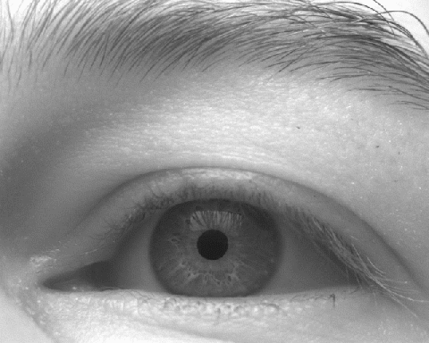

<div align="center">
  <br>
</div>

-----------------

<div align="center">
  <a href="https://www.frontiersin.org/journals/neuroscience" alt="Publication">
        </a>
 <a href="https://www.gnu.org/licenses/gpl-3.0.txt" alt="GNU-GPLv3">
        </a>
 <a href="https://github.com/openPupil/Open-PupilEXT" alt="Version">
        </a>
 <a href="https://github.com/openPupil/Open-PupilEXT" alt="Contribution">
        </a>
</div>

# *Code Repository of the Article* <br/>PupilEXT: flexible open-source platform for high resolution pupillometry in vision research

This repository provides the official implementation of a free pupillometry cross-platform (MacOS, Windows, Linux) system called PupilEXT proposed in the article *"PupilEXT: flexible open-source platform for high resolution pupillometry in vision research"* authored by [Babak Zandi](https://www.lichttechnik.tu-darmstadt.de/fachgebiet_lichttechnik_lt/team_lt/mitarbeiter_lt_detail_65600.en.jsp), Moritz Lode, Alexander Herzog, Georgios Sakas and [Tran Quoc Khanh](https://www.lichttechnik.tu-darmstadt.de/fachgebiet_lichttechnik_lt/team_lt/mitarbeiter_lt_detail_34952.en.jsp) from the Technical University of Darmstadt. PupilEXT can record eye images using a stereo camera system or a single camera to measure the pupil diameter in real-time. Additionally, it is possible to analyse externally-recorded images without connected cameras through the PupilEXT interface.<br/>

The pupil diameter has become an important biomarker in medical diagnostics or cognitive psychology. Additionally, the human pupil behaviour as a function of light spectra is the subject of current research efforts to characterise and model the neuro visual process behind the pupil light response. Usually, commercial eye-tracking systems are used to measure the pupil diameter, which is associated with high investment costs. Therefore, we aimed to provide a professional open-source pupillometry measurement platform, making an easy and inexpensive entry into pupil research for interdisciplinary research groups possible. PupilEXT integrates high-resolution industrial cameras from Basler. The pupil detection itself can be performed with one of the state-of-the-art open-source algorithms, ElSe [[1\]](#1), ExCuSe [[2\]](#2), PuRe [[3\]](#3), PuReST [[4\]](#4), Starburst [[5\]](#5), and Swirski2D [[6\]](#6).

**Features of PupilEXT**
- [x]  High resolution pupillometry
- [x]  Real-time pupillometry 
- [x]  Professional graphical user interface prgrammed with QT/C++ 
- [x]  Supporting stereo camera setups
- [x]  Supporting single camera setups
- [x]  Supporting all Basler branded cameras 
- [x]  Offline pupillometry with externally recorded images 
- [x]  Cross-platform software: MacOS, Windows, Linux
- [x]  Intgrates six leading open-source pupil detection algorithms: ElSe [[1\]](#1), ExCuSe [[2\]](#2), PuRe [[3\]](#3), PuReST [[4\]](#4), Starburst [[5\]](#5), and Swirski2D [[6\]](#6).

If you need help to setup our proposed pupillometry system for your research, feel free to contact the corresponding author Babak Zandi.

**Correspondence:** [zandi@lichttechnik.tu-darmstadt.de](mailto:zandi@lichttechnik.tu-darmstadt.de)

<p align="center">
  
</p>

## 1. Overview
PupilEXT is a real-time pupillometry software whose graphical user interface is mainly programmed using C++ (QT. 5.15) and can be used to integrate high-resolution industrial cameras for online measurements. This Repository provides a guide on how to install, set up and use the system for pupillometry. Before using the PupilEXT framework, we recommend reading the work *"PupilEXT: flexible open-source platform for high resolution pupillometry in vision research"*.

### 1.1 Pupillometry setup configuations
With PupilEXT, you can detect the pupil diameter with three different setup configurations (see Figure). In the stereo camera configuration, the pupil diameter can be recorded directly in millimetres through an internal triangulation procedure. In the simplest case, only one camera must be connected for measuring the pupil diameter in pixels. The conversion from pixels to mm can then manually be performed using a circular reference object. If no camera is available, PupilEXT offers the possibility to load externally recorded images for offline analysis. The externally acquired images can be treated as a live feed, unlocking the full functionality of PupilEXT.

<p align="center">
  
</p>

### 1.2 Hardware and software requirements
Depending on which setup configuration is used, additional hardware components must be purchased. Below is a list of components with which our demo system was built. In general, every Basler branded camera is compatible with PupilEXT. For offline analysis with externally captured images, none of the listed hardware components is necessary. In any case, the [Pylon Camera Software Suite](https://www.baslerweb.com/de/produkte/software/basler-pylon-camera-software-suite/) from Basler must be installed on your system, as the drivers are needed to start PupilEXT, even if no camera(s) is connected. Check out our publication if you need additional information on how to build the hardware system.

**Components: Stereo camera configuration**

- 2 x Basler acA2040-120um (USB3 cameras)
- 2 x KOWA LM50JC3M2 (2/3" C-Mount lenses)
- 2 x Schneider IF 092 SH 27.0 (Filters)
- 2 x H06S Power I/O Cable
- 1 x STM32 Nucleo F767ZI or similar (Hardware trigger)
- 1 x IR-illumination (Recommended)

**Components: Single camera configuration**

- 1 x Basler acA2040-120um (USB3 cameras)
- 1 x KOWA LM50JC3M2 (2/3" C-Mount lense)
- 1 x Schneider IF 092 SH 27.0 (Red & NIR Color Filter)
- *1 x H06S Power I/O Cable (Optional)*
- *1 x STM32 Nucleo F767ZI or similar (Optional)*
- 1 x IR-illumination (Recommended)

## 2. Getting started: The easy way
### 2.1. Installation on MacOS (macOS 10.15 or later)
The direct installation requires that you have macOS 10.15 or later installed on your machine. If this is not the case, you need to build PupilEXT from source, as the provided pre-build binaries in this section will only work on macOS 10.15 or later.

**Step 1: Download and install the Pylon Camera Softwware**

Download the Pylon Camera Software Suite (*.dmg) from the Basler Website:

https://www.baslerweb.com/de/vertrieb-support/downloads/downloads-software/

We tested PupilEXT with Pylon 6.2.0. If the Pylon installation does not start because of a security warning from Apple: Open the system preferences from macOS, click on "security & privacy" and press "Open Anyway" under the "General" tab. During the Pylon installation, ensure that a complete installation is carried out with the C++ binaries. The Pylon library is necessary for PupilEXT to control and communicate with Basler branded cameras. The installation is also needed if no camera is connected, as the Basler drivers are part of the software.

Please test your Baslers camera(s) with the installed Pylon Viewer from Basler (see [Basler-Documentation: Pylon Viewer](https://docs.baslerweb.com/overview-of-the-pylon-viewer)) before driving the camera(s) with PupilEXT.

**Step 2: Download and run PupilEXT**

We have built and deployed PupilEXT for macOS 10.15 or later. You only need to download PupilEXT and open it. If you run into security warnings from Apple, you need to open the system preferences, click on "security & privacy" and then press "Open Anyway" under the "General" tab.

Download PupilEXT Version 0.1.0 Beta (MAC): [(PupilEXT-macOS-0.1.0-Beta-Release.dmg, 95.2 MB)](https://storage.googleapis.com/pupilext-data-repository/PupilEXT-Releases/PupilEXT-macOS-Release-0.1.0-Beta.dmg)

After you have downloaded the software, you can open the dmg file and run PupilEXT (see animation). We tested the program on a fresh installed Macbook Pro (Intel) with macOS Big Sur (Version 11.2.3) and a Mac Mini (Intel) with macOS Catalina (Version 10.15.7). If you run into issues, you need to build PupilEXT from source.

<p align="center">
  
</p>

**Additional Information**

It should be noted that the PupilEXT software is not designed for the dark-mode of macOS, as the icons in the quick-toolbar are colored with black lines. Therefore, the icons will not be visible when running PupilEXT in dark mode. We recommend to use the software only in light-mode of macOS.

### 2.2. Installation on Windows 10
**Step 1: Download and install the Pylon Camera Softwware**

Download the Pylon Camera Software Suite (*.exe) from the Basler Website:

https://www.baslerweb.com/de/vertrieb-support/downloads/downloads-software/

We tested PupilEXT with Pylon 6.2.0. During the Pylon installation, ensure that a complete installation is carried out with the C++ binaries. The Pylon library is necessary for PupilEXT to control and communicate with Basler branded cameras. The installation is also needed when no camera is connected, as the Basler drivers are part of the software.

Please test your camera with the installed Pylon Viewer from Basler (see [Basler-Documentation: Pylon Viewer](https://docs.baslerweb.com/overview-of-the-pylon-viewer)) before driving the cameras with PupilEXT.

**Step 2: Download and run PupilEXT**

For Windows, we have already built the software so that PupilEXT can simply be downloaded and will start without any further dependencies. Unpack the downloaded zip file and open PupilEXT.exe. It should run, as we tested it on several systems. However, if you run into unknown issues, you need to build PupilEXT from source.

Download PupilEXT Version 0.1.0 Beta (Windows): [(PupilEXT-WIN-0.1.0-Beta-Release.zip, 41.6 MB)](https://storage.googleapis.com/pupilext-data-repository/PupilEXT-Releases/PupilEXT-WIN-Release-0.1.0-Beta.zip)

### 2.3. Setup the microcontroller for the stereo camera configuration
A microcontroller is necessary if a real-time online pupil measurement should be carried out with a stereo camera system. The microcontroller has the task of generating a so-called electrical hardware-trigger, which is used to trigger the image acquisition on the camera (see [Basler-Documentation: Triggering](https://docs.baslerweb.com/triggered-image-acquisition)). The electrical hardware-trigger consists of a timed voltage signal of 3.3 V, which is applied to one of the camera's GPIO-Pins. If a sequence of images need to be acquired with a stable FPS, the hardware-trigger is a PWM-signal with a fixed frequency (see [Basler-Documentation: Trigger-Types](https://docs.baslerweb.com/trigger-selector) and [Basler-Documentation: GPIO Lines](https://docs.baslerweb.com/general-purpose-io-(gpio)-lines)). The advantage of acquiring images through a hardware-trigger signal is that the electrical signal can be connected parallel to both cameras, leading to a highly synchronized image recording. Synchronous image acquisition from both cameras is essential in a stereo camera system; otherwise, the conversion from pixels to mm is not reliable. The PupilEXT software uses a hardware-trigger from an external microcontroller (STM32 Nucleo) to acquire images from the stereo camera system. If you only want to use a single camera for pupil measurement, section 2.3 is not relevant for you.

In this way, the image capture process is as follows: The PupilEXT software sends a command (Protocol) to the microcontroller via USB (uart), aiming to start a logical hardware-trigger signal, which is transmitted from the microcontroller to the camera(s). The captured images are passed directly from the camera to PupilEXT via USB3. In continuous shooting, PupilEXT sends a command to let the microcontroller generate a continuous PWM signal, so there is no need for a single command for each trigger signal. This procedure is standard for all professional stereo camera systems. Hardware trigger signals can also be generated from the camera itself, but there is a risk that due to internal delays, the images will not be captured synchronously. Therefore, adding an external signal generator increases the stability of the system.

Since a standardised protocol between the PupilEXT software and the microcontroller is required, we have uploaded the corresponding embedded code in this repository in [``Microcontroller/STMNucleo_F767ZI``](Microcontroller/STMNucleo_F767ZI) and [``Microcontroller/STMNucleo_L432KC``](Microcontroller/STMNucleo_L432KC). The embedded projects were created using PlatformIO in Visual Studio Code. You can use either an STM32 Nucleo F767ZI or STM32 Nucleo L432KC microcontroller to flash our provided code to the microcontroller. Alternatively, you can use your own microcontroller, but you must pay attention to the communication protocol (see our publication).

We used the [Mbed 5 framework](https://os.mbed.com) for programming the STM32 Nucleo microcontroller. To simplify the flashing process for you, we highly recommend flashing the microcontroller using [Mbed Studio](https://os.mbed.com/studio/), as this is more user-friendly. Below is a step-by-step guide on how to flash the microcontroller with Mbed Studio.

**Step 1: Installation of Mbed Studio**

Download and install Mbed Studio. A free account is required before you can use it. 

https://os.mbed.com/studio/

**Step 2: Flash the microcontroller**

Create a new project inside Mbed Studio and select your connected microcontroller from the list. In the following, we assume that you are using an STM32 Nucleo L432KC. Be sure to select Mbed OS 5 as a template from the list. You can select an empty programme as template. In the fresh created main.cpp file, paste the below-listed code and press the play button in Mbed Studio (Build profile: Release) to flash the microcontroller. If you are using an STM32 Nucleo F767ZI, use another code from the file [Microcontroller/STMNucleo_F767ZI/src/main.cpp](Microcontroller/STMNucleo_F767ZI/src/main.cpp), as the pin assignment is different.

```c++
#include "RawSerial.h"
#include "mbed.h"
#include <string>
#include <stdio.h>
#include <stdlib.h>

#define BUFF_LENGTH 15
#define BAUDRATE 115200

#define TX_PIN USBTX
#define RX_PIN USBRX

#define LED_PIN_1 LED1
#define Trigger_Pin PB_0

RawSerial pc(TX_PIN, RX_PIN);
volatile char rx_buf[BUFF_LENGTH];
Timer timer_Stopper;

DigitalOut LED_Green(LED_PIN_1);
DigitalOut Trigger(Trigger_Pin);
Ticker myTick;

// Global Values
char M_or_T; // T = Manually Trigger Mode
uint32_t Manually_Values[2];
uint32_t Automatic_Values[1];

volatile int flag_1 = 0;
volatile int flag_2 = 0;
int LED_ticker = 0;
int Threshold_Ticker = 0;
int STOP = 0;

void onTick() {
  LED_Green = !LED_Green;
  Trigger = !Trigger;
  LED_ticker++;
  if (LED_ticker >= 2 * Threshold_Ticker) {
    myTick.detach();
    LED_Green = 0;
    Trigger = 0;
  }
  if (STOP == 1) {
    myTick.detach();
    LED_Green = 0;
    Trigger = 0;
  }
}

void serialCb() {

  char *pch;
  pch = strtok((char *)rx_buf, "X");

  M_or_T = *pch;

  if (M_or_T == 'T') {
    pch = strtok(NULL, "X");
    Manually_Values[0] = atoi(pch);

    pch = strtok(NULL, "X");
    Manually_Values[1] = atoi(pch);
  }

  switch (M_or_T) {

  case 'T':
    Threshold_Ticker = Manually_Values[0];
    STOP = 0;
    LED_ticker = 0;
    myTick.attach_us(&onTick, Manually_Values[1]);
    break;

  case 'S':
    STOP = 1;
    break;

  default:
    break;
  }
}

void callback() {
  if (pc.getc() == '<') {
    pc.putc('<');
    for (int i = 0; i < 20; i++) {

      rx_buf[i] = pc.getc();

      if (rx_buf[i] != '>') {
        pc.putc(rx_buf[i]);
      }

      if (rx_buf[i] == '>') {
        pc.putc('>');
        pc.putc('\n');
        flag_1 = 1;
        break;
      }
    }
  }
}

int main() {
  LED_Green = 0;
  LED_ticker = 0;
  Trigger = 0;
  pc.baud(115200);
  pc.attach(&callback, Serial::RxIrq);
  pc.printf("Program started! \n");

  while (1) {
    if (flag_1 == 1) {
      serialCb();
      flag_1 = 0;
    }
  }
}
// STM32 Nucleo L432KC flashing code
// The provided code for the STM32 Nucleo is licensed under the MIT
// See the lincense file in this repostory:
// Microcontroller/STMNucleo_L432KC/LICENSE
```

**Step 3: Wire the components together:**

Plug the two purchased I/O cables (see section 1.2: Hardware requirements) into the I/O connector of camera 1 and 2. At the open end of the I/O cable are the respective 6 I/O lines of the camera. PIN 1, corresponding to Line 3 of the I/O cable can be used to apply a logical hardware trigger signal to the Basler acA2040-120um camera. Please read the documentation and warnings of your camera regarding the I/O PINs, otherwise you may damage your camera if the wrong voltage values are used (see [Basler-Manual: GPIO Lines](https://docs.baslerweb.com/general-purpose-io-(gpio)-lines)). Pay attention to the correct PIN numbers of the I/O connector and check the camera's documentation to see which I/O PIN is the correct one for your case: https://docs.baslerweb.com/aca2040-120um

Connect the respective I/O line of camera 1 and camera 2 in parallel with the trigger PIN on the microcontroller. If you have used our embedded code to flash the microcontroller, it is PIN ``PB_0`` on the STM32 Nucleo L432KC or PIN ``PC_6`` on the STM32 Nucleo F767ZI. You can check where the PIN is located on the board by checking the Mbed webpage:

Pinout sketch STM32 Nucleo L432KC: https://os.mbed.com/platforms/ST-Nucleo-L432KC/

Pinout sketch STM32 Nucleo F767ZI: https://os.mbed.com/platforms/ST-Nucleo-F767ZI/

We recommend verifying that the microcontroller has been successfully flashed. To do this, you can enter the following command <TX10X1000000> (Protocol: <T X Count_of_Trigger X Time_Trigger_on_us>) in a serial monitor (Baudrate: 115200). For this, either the integrated serial monitor of Mbed Studio can be used or another one like HWMonitor or [CoolTerm](https://freeware.the-meiers.org). This command should start a flashing green LED (10 times) on the microcontroller, with a turn-on time of 1000000 microseconds in each cycle. Since the hardware-trigger PIN of the microcontroller is "connected" to the LED, it signifies that the PC-to-microcontroller communication and the signal generation are working. Additionally, the trigger signal can be measured using an oscilloscope. 

Once the microcontroller's correct operation has been checked, the cameras can be connected to the microcontroller and the PC via USB. Simultaneously, the hardware trigger PIN of the microcontroller should be connected in parallel with GPIO PINs of camera 1 and camera 2. Do not forget to connect the GND line of the camera to the GND PIN of the microcontroller. The figure in [``img/PupilEXT_Measuremtn_Setups.png``](img/PupilEXT_Measuremtn_Setups.png) illustrates the setup of a stereo camera configuration. After the connection has been made correctly, the PupilEXT software can be started to begin measuring the pupil diameter through the stereo camera system.

### 2.4. Demo dataset for offline analysis
We provide three different recorded datasets containing eye images that can be analysed using PupilEXT. This should give users the possibility to work directly with the software PupilEXT. The first two data sets were recorded using a single camera. Data set number 3 was recorded with a stereo camera system and is used in the video tutorial of PupilEXT (see section 2.5). The images were acquired directly with PupilEXT, as we offer the feature to record images for later offline measurement of the pupil diameter without connected cameras. The data set is suitable for playing around with PupilEXT and getting a first impression.

| Description | Preview | Download-Link | File-size |
| :---         |     :---:      |          :---: |         :---: |
| Recorded with a single camera under natural light with a filter in front of the lens. Dataset is without a calibration file. |  | [Download dataset 1](https://storage.googleapis.com/pupilext-data-repository/PupilEXT-Demo-Data/Single_camera_recording_1.zip) | 1.2 GB |
| Recorded with a single camera under natural light without a filter in front of the lens. Dataset is without a calibration file |  | [Download dataset 2](https://storage.googleapis.com/pupilext-data-repository/PupilEXT-Demo-Data/Single_camera_recording_2.zip) | 600 MB |
| Recorded using a stereo camera system with IR-illumination and a filter in front of the lens. Calibration files are available and loaded to PupilEXT. |  | [Download dataset 3](https://storage.googleapis.com/pupilext-data-repository/PupilEXT-Demo-Data/Stereo_camera_recording_2.zip) | 9.6 GB |

### 2.5 Notes about the pupil detection acuracy

The pupil detection can be determined in PupilEXT with one of the six open-source pupil detection methods ElSe [[1\]](#1), ExCuSe [[2\]](#2), PuRe [[3\]](#3), PuReST [[4\]](#4), Starburst [[5\]](#5), and Swirski2D [[6\]](#6). The respective algorithm can be selected directly within the pupillometry interface. A pupil measurement's accuracy depends on the applied detection algorithm if the image quality and composition are ideal. Each pupil detection algorithm has a certain number of parameters (constants) that the user must set.  For instance, at least the minimum or maximum possible pupil diameter must be adjusted, which can depend on the image's resolution. In PupilEXT, we offer the possibility to adjust the parameters of an applied detection algorithm, leading to more freedom in increasing the measurement accuracy. The original publications' standard parameters are usually not ideal for all measurement settings and should be adjusted if the detection rate is not good enough.

The accuracy can also be increased by selecting a specific region of interest (ROI) in the image. In this way, the algorithm no longer needs to perform pupil detection over the entire image. A smaller ROI size also reduces the calculation time, allowing a higher framerate in real-time measurements. We provide different preset settings for the algorithms` parameters which are dependent on the used ROI size. However, we highly recommend using the PuRe or PuReST algorithm, as it needs only three parameters. Furthermore, these two pupil detection algorithms are considered both the fastest and accurate in the literature and are part of the amazing open-source eye-tracking software EyeRecToo [[7\]](#7). According to our preliminary investigations, the Swirski algorithm can provide better results, as it does not downscale the image before a pupil detection. The downside is that it needs a higher calculation time and has a higher number of parameters. There is the risk that the parameters do not match the image composition, leading to poor pupil detection accuracy.

### 2.5. How to use PupilEXT ?
Three videos are provided to illustrate the handling and the features of the *PupilEXT* software. The first video introduces the *PupilEXT* software in stereo vision mode. The second video shows how the pupillometry can be carried out by using a single camera. The third video shows how pupillometry can be carried out with existing eye images without connected cameras.

**Video Tutorial 1 – Stereo camera setup:** [Link to Video 1](https://1drv.ms/v/s!AhN8-XVXLRd2jq0hC0UQx-4B4CYS3g?e=4JGTRm)

**Video Tutorial 2 – Single camera setup:** [Link to Video 2](https://1drv.ms/v/s!AhN8-XVXLRd2jq0iOBu4RvDjcSzdDQ?e=fuQiFX)

**Video Tutorial 3 – Offline analysis:** [Link to Video 3](https://1drv.ms/v/s!AhN8-XVXLRd2jq0jU9IHQXIEmO6Ogg?e=X4OxaG)

## 3. Build PupilEXT from source: The advanced way
If you want to extend PupilEXT with your own features or if the provided installations cannot be opened on your machine, building PupilEXT on your own computer is a good alternative. We recommend using CLion for this: https://www.jetbrains.com/clion/

PupilEXT need the following libraries: Boost 1.75-0_2, Ceres 2.0.0, Eigen 3.3.9, OpenCV 4.5.1_3, QT 5.15.0, [spii](https://github.com/PetterS/spii), tbb, pylon 6.

### 3.1 How to build from source on MacOS

**Step 1: Download and install the Pylon Camera Softwware**

Download the Pylon Camera Software Suite (*.dmg-File) from the Basler Website:
https://www.baslerweb.com/de/vertrieb-support/downloads/downloads-software/

**Step 2: Download and install QT**

Download the QT from the website. Please install QT 5.15:
https://www.qt.io/download-open-source?hsCtaTracking=9f6a2170-a938-42df-a8e2-a9f0b1d6cdce%7C6cb0de4f-9bb5-4778-ab02-bfb62735f3e5

**Step 3: Install the package manager homebrew**

Homebrew is a package manager for macOS with which C++ libraries can be installed relatively easily via the terminal. Instructions on how to install Homebrew can be found here: https://brew.sh

To install homebrew , you can enter the following command in the macOS terminal.

```shell
/bin/bash -c "$(curl -fsSL https://raw.githubusercontent.com/Homebrew/install/HEAD/install.sh)"
```

**Step 4: C++ Libraries**

Now install the necessary C++ libraries for PupilEXT through homebrew. The Ceres library will be installed by OpenCV.

```shell
brew install cmake
brew install boost
brew install Eigen
brew install glog
brew install tbb
brew install opencv
```

**Step 5: Download and build the spin library**

An additional library called spii must be downloaded and built manually. This library is not included in Homebrew. First, go to the following GitHub repository and download it:

https://github.com/PetterS/spii

Open the downloaded folder ``spii-master`` with [CLion](https://www.jetbrains.com/clion/). By default, CLion is set to debug mode. Therefore, the release option must be added. For this, go to CLion > Preferences > Build, Execution, Deployment in the toolbar. Then press the + symbol under CMake, which automatically adds the release mode. You can then switch to release in the top right-hand corner of the CLion toolbar. You can now build the project. Simply go to Build > Build Project.

**Step 6: Add spii to PupilEXT**

The source files of PupilEXT are located here in Github under the PupilEXT folder. Download it from GitHub and create a new folder called ``PupilEXT/external`` in the main PupilEXT folder. In ``external/`` add another new folder called ``spii/``. 

In the folder ``PupilEXT/external/spii`` you need to copy the spii build created in step 5. First go to ``spii-master/cmake-build-release`` and copy the folder ``spii-master/cmake-build-release/lib`` to ``spii-master``. Then copy all files inside the ``spii-master/`` folder into ``PupilEXT/external/spii``.

**Step 7: Build PupilEXT from source**

Now, open the PupilEXT project with CLion. In the file ``PupilEXT/CMakeLists.txt`` the paths must be updated so that the installed C++ libraries from step 4 can be correctly recognised. The complete content in ``PupilEXT/CMakeLists.txt`` can be removed and replaced by the following code snippet:

```cmake
cmake_minimum_required(VERSION 3.15)
project(PupilEXT)
set(CMAKE_CXX_STANDARD 17)

set(CMAKE_AUTOMOC ON)
set(CMAKE_AUTORCC ON)
set(CMAKE_AUTOUIC ON)

if(CMAKE_VERSION VERSION_LESS "3.7.0")
    set(CMAKE_INCLUDE_CURRENT_DIR ON)
endif()

set(CMAKE_MODULE_PATH ${CMAKE_MODULE_PATH} ${PROJECT_SOURCE_DIR}/cmake)
set(CMAKE_PREFIX_PATH ${CMAKE_PREFIX_PATH} "/Users/papillon/Qt/5.15.2/clang_64")
set(CMAKE_PREFIX_PATH ${CMAKE_PREFIX_PATH} "/usr/local/Cellar/glog/0.4.0")
set(CMAKE_PREFIX_PATH ${CMAKE_PREFIX_PATH} "/usr/local/include/gflags")
set(CMAKE_PREFIX_PATH ${CMAKE_PREFIX_PATH} "/Library/Frameworks/pylon.framework")
set(CMAKE_PREFIX_PATH ${CMAKE_PREFIX_PATH} "/usr/local/Cellar/tbb/2020_U3_1")

set(SPII_INSTALL_DIR "/Users/papillon/Desktop/PupilEXT/external/spii")
set(spii_INCLUDE_DIRS ${SPII_INSTALL_DIR}/include)
set(GLOG_INCLUDE_DIR "/usr/local/Cellar/glog/0.4.0/include")
set(EIGEN_INCLUDE_DIR "/usr/local/Cellar/eigen/3.3.9/include/eigen3/Eigen")
set(EIGEN3_INCLUDE_DIR "/usr/local/include/eigen3")
SET("OpenCV_DIR" "/usr/local/Cellar/opencv/4.5.1_3/lib/cmake/opencv4")
SET("TBB_DIR" "/usr/local/Cellar/tbb/2020_U3_1/lib/cmake/TBB")

if(CMAKE_BUILD_TYPE STREQUAL Debug)
    set(CMAKE_PREFIX_PATH ${CMAKE_PREFIX_PATH} "/usr/local/share/ceres-solver")
else()
    set(CMAKE_PREFIX_PATH ${CMAKE_PREFIX_PATH} "/usr/local/share/ceres-solver")
endif()

set(PYLON_HOME "/Library/Frameworks/pylon.framework")
set(PYLON_INCLUDE_DIR "/Library/Frameworks/pylon.framework/Headers")

find_package(Qt5 COMPONENTS Widgets Concurrent SerialPort Charts Svg PrintSupport REQUIRED)
find_package(OpenCV REQUIRED PATHS "/usr/local/Cellar/opencv/4.5.1_3")
find_package(Boost 1.72 REQUIRED)
find_package(TBB REQUIRED PATHS "${PROJECT_SOURCE_DIR}/external/tbb")
find_package(Eigen3 REQUIRED )
find_package(Ceres REQUIRED)
find_package(Pylon REQUIRED)
find_package(OpenGL REQUIRED)

set(TBB_LIBRARY_DEBUG "/usr/local/include/tbb")
set(TBB_LIBRARY_RELEASE "/usr/local/include/tbb")

find_library (spii_LIBRARY_RELEASE
        spii
        PATHS ${SPII_INSTALL_DIR}/lib/)
find_library (meschach_LIBRARY_RELEASE
        meschach
        PATHS ${SPII_INSTALL_DIR}/lib/)
if (spii_LIBRARY_RELEASE AND meschach_LIBRARY_RELEASE)
    set(spii_LIBRARIES ${spii_LIBRARY_RELEASE} ${meschach_LIBRARY_RELEASE})
else()
    set(spii_LIBRARIES "")
endif()

include_directories(${Qt5Core_INCLUDE_DIRS}
        ${OpenCV_INCLUDE_DIRS}
        ${Boost_INCLUDE_DIRS}
        ${TBB_INCLUDE_DIR}
        ${spii_INCLUDE_DIRS}
        ${EIGEN_INCLUDE_DIR}
        ${CERES_INCLUDE_DIRS}
        ${PYLON_INCLUDE_DIR}
        "singleeyefitter")

add_subdirectory (src)
add_subdirectory (singleeyefitter)

message(STATUS "")
message(STATUS "spii_LIBRARIES:\"${spii_LIBRARIES}\"")
message(STATUS "--- Include directories ---" )
message(STATUS " QT5Core_INCLUDE_DIRS: ${Qt5Core_INCLUDE_DIRS}" )
message(STATUS " OpenCV_INCLUDE_DIRS: ${OpenCV_INCLUDE_DIRS}" )
message(STATUS " Boost_INCLUDE_DIRS: ${Boost_INCLUDE_DIRS}" )
message(STATUS " TBB_INCLUDE_DIRS: ${TBB_INCLUDE_DIR}" )
message(STATUS " spii_INCLUDE_DIRS: ${spii_INCLUDE_DIRS}" )
message(STATUS " EIGEN_INCLUDE_DIR: ${EIGEN_INCLUDE_DIR}" )
message(STATUS " CERES_INCLUDE_DIRS: ${CERES_INCLUDE_DIRS}" )
message(STATUS " PYLON_INCLUDE_DIRS: ${PYLON_INCLUDE_DIR}" )
message(STATUS "---------------------------" )
message(STATUS "")
set(CMAKE_CXX_FLAGS "${CMAKE_CXX_FLAGS} -march=native -O3")
```

Make sure that all folder paths in the ``CMakelist.txt`` are adapted to your system. For instance, the path ``/Users/papillonmac/Qt/5.15.0/clang_64`` must be changed with the name of your user name and your specific QT version installed on your PC.

The last step is to change something in the Pylon library; otherwise, the library will not be found properly. For this, open the following folder on your computer: 

/Library/Frameworks/pylon.framework/Versions/A/Headers/GenICam. All files in this folder must be copied to /Library/Frameworks/pylon.framework/Versions/A/Headers. Now, you should be able to start PupilEXT properly in CLion. Please remember to use the release option as in step 5; otherwise, PupilEXT will run in debug mode and will be significantly slower. 

### 3.2 How to build from source on Windows 10

**Step 1: Install Visual Studio 2019**

C++ MFC must be installed during the installation. Additionally, the English language package must be included. Visual Studio can be downloaded from the following page:

https://visualstudio.microsoft.com/downloads/

**Step 2: Download and install the Pylon Camera Software**

Download the Pylon Camera Software Suite (*.dmg) from the Basler Website:
https://www.baslerweb.com/de/vertrieb-support/downloads/downloads-software/

**Step 3: Download and install QT**

Download the QT from the website. Please install QT 5.15. You need to add ``msvc2017_64`` during the installation:
https://www.qt.io/download-open-source?hsCtaTracking=9f6a2170-a938-42df-a8e2-a9f0b1d6cdce%7C6cb0de4f-9bb5-4778-ab02-bfb62735f3e5

**Step 4: Install the C++ package manager**

There is a C++ package manager from Microsoft for Windows, making it relatively easy to download libraries. For this, install the program ``vcpkg``. The instructions on how to install the package manager can be found on the following page:

https://docs.microsoft.com/de-de/cpp/build/install-vcpkg?view=msvc-160&tabs=windows

To install vcpkg type in your console the following commands:

```shell
git clone https://github.com/Microsoft/vcpkg.git
cd vcpkg
.\bootstrap-vcpkg.bat
```

**Step 5: Install the C++ Librarys**

Go to your console and use the following commands to install the C++ libraries:

```shell
vcpkg install boost:x64-windows
vcpkg install Eigen:x64-windows
vcpkg install ceres:x64-windows
vcpkg install glog:x64-windows
vcpkg install opencv:x64-windows
vcpkg install tbb:x64-windows
```

**Step 6: Download and build spii**

The spii library is not included in vcpkg. You need to build it manually. First, go to the following page and download the spii library from GitHub:

https://github.com/PetterS/spii

Then [CLion](https://www.jetbrains.com/clion/) can be used to open and build the spii library. Make sure that you use the 64 bit architecture. Then the folder ``spii-master/cmake-build-release/lib`` can be copied into the main folder ``spii-master/``. Lastly, copy the files inside ``spii-master/`` to ``PupilEXT/external/spii``.

**Step 7: Prepare the CMakelists file**

You can add the following code snippet to the file ``PupilEXT/CMakeLists.txt``  to let PupilEXT recognize vcpkg libraries. Make sure to adjust the appropriate paths and version numbers.

```cmake
cmake_minimum_required(VERSION 3.15)
project(PupilEXT)

set(CMAKE_AUTOMOC ON)
set(CMAKE_AUTORCC ON)
set(CMAKE_AUTOUIC ON)
if(CMAKE_VERSION VERSION_LESS "3.7.0")
    set(CMAKE_INCLUDE_CURRENT_DIR ON)
endif()

set(CMAKE_MODULE_PATH ${CMAKE_MODULE_PATH} ${PROJECT_SOURCE_DIR}/cmake)
set(CMAKE_PREFIX_PATH ${CMAKE_PREFIX_PATH} "C:/Qt/Qt5.13.1/5.10.0/msvc2017_64")
set(CMAKE_PREFIX_PATH ${CMAKE_PREFIX_PATH} "C:/vcpkg/installed/x64-windows")
set(GLOG_INCLUDE_DIR "C:/vcpkg/installed/x64-windows/include")
if(CMAKE_BUILD_TYPE STREQUAL Debug)
    set(CMAKE_PREFIX_PATH ${CMAKE_PREFIX_PATH} "C:/vcpkg/installed/x64-windows/debug")
else()
    set(CMAKE_PREFIX_PATH ${CMAKE_PREFIX_PATH} "C:/vcpkg/installed/x64-windows/include")
endif()

set(TBB_INCLUDE_DIR "C:/vcpkg/installed/x64-windows/include/tbb")
set(SPII_INSTALL_DIR "${PROJECT_SOURCE_DIR}/external/spii")
set(spii_INCLUDE_DIRS ${SPII_INSTALL_DIR}/include)
set(PYLON_HOME "C:/Program Files/Basler/pylon 6/Development/")
find_package(Qt5 COMPONENTS Widgets SerialPort Charts Svg PrintSupport REQUIRED)
find_package(OpenCV REQUIRED)
find_package(Boost 1.72 REQUIRED)
find_package(TBB REQUIRED PATHS "${PROJECT_SOURCE_DIR}/external/tbb")
find_package(Eigen3 REQUIRED )
find_package(Ceres CONFIG REQUIRED)
find_package(Pylon REQUIRED)
set(TBB_LIBRARY_DEBUG "${PROJECT_SOURCE_DIR}/external/tbb/lib/intel64")
set(TBB_LIBRARY_RELEASE "${PROJECT_SOURCE_DIR}/external/tbb/lib/intel64")

find_library (spii_LIBRARY_RELEASE
        spii
        PATHS ${SPII_INSTALL_DIR}/lib/)
find_library (meschach_LIBRARY_RELEASE
        meschach
        PATHS ${SPII_INSTALL_DIR}/lib/)
if (spii_LIBRARY_RELEASE AND meschach_LIBRARY_RELEASE)
    set(spii_LIBRARIES ${spii_LIBRARY_RELEASE} ${meschach_LIBRARY_RELEASE})
else()
    set(spii_LIBRARIES "")
endif()

include_directories(${Qt5Core_INCLUDE_DIRS}
        ${OpenCV_INCLUDE_DIRS}
        ${Boost_INCLUDE_DIRS}
        ${TBB_INCLUDE_DIR}
        ${spii_INCLUDE_DIRS}
        ${EIGEN_INCLUDE_DIR}
        ${CERES_INCLUDE_DIRS}
        ${PYLON_INCLUDE_DIR}
        "singleeyefitter")

add_subdirectory (src)
add_subdirectory (singleeyefitter)

message(STATUS "")
message(STATUS "spii_LIBRARIES:\"${spii_LIBRARIES}\"")
message(STATUS "--- Include directories ---" )
message(STATUS " QT5Core_INCLUDE_DIRS: ${Qt5Core_INCLUDE_DIRS}" )
message(STATUS " OpenCV_INCLUDE_DIRS: ${OpenCV_INCLUDE_DIRS}" )
message(STATUS " Boost_INCLUDE_DIRS: ${Boost_INCLUDE_DIRS}" )
message(STATUS " TBB_INCLUDE_DIRS: ${TBB_INCLUDE_DIR}" )
message(STATUS " spii_INCLUDE_DIRS: ${spii_INCLUDE_DIRS}" )
message(STATUS " EIGEN_INCLUDE_DIR: ${EIGEN_INCLUDE_DIR}" )
message(STATUS " CERES_INCLUDE_DIRS: ${CERES_INCLUDE_DIRS}" )
message(STATUS " Pylon_INCLUDE_DIRS: ${PYLON_INCLUDE_DIR}" )
message(STATUS "---------------------------" )
message(STATUS "")
set(CMAKE_CXX_FLAGS "${CMAKE_CXX_FLAGS} -march=native -O3")
```

**Step 8: Environment variables**

Add the bin folder of vcpkg and QT to the environment variables of Windows; otherwise, the libraries will not be found.

**Step 9: Build PupilEXT with CLion**

Before the programme can be build, some settings must be made in CLion:

1) File > Setting > Build, Execution, Deoployment > CMAKE under CMAKE options add the following parameter: --config Debug -DVCPKG_TARGET_TRIPLET=x64-windows -DCMAKE_TOOLCHAIN_FILE=C:/vcpkg/scripts/buildsystems/vcpkg.cmake

2) Then press the plus sign to add the release configuration. Add the following parameters to the release options:: --config Release -DVCPKG_TARGET_TRIPLET=x64-windows -DCMAKE_TOOLCHAIN_FILE=C:/vcpkg/scripts/buildsystems/vcpkg.cmake

3) The build architecture must be changed to amd64 under Toolchain, as the vcpkg libraries were also installed with 64 bit.

Next, the bin folders must be added to the path of CLION, as these are independent of the Windows environment variables. Under Run > Edit Configuration the paths to VCPKG and QT can be added:

```shell
C:\Qt\Qt5.13.1\5.10.0\msvc2017_64\bin
C:\vcpkg\installed\x64-windows\bin
```

In order to start the programme, the SPII DLL must be added to ``PupilEXT\cmake-build-debug\src``. If everything has been done correctly, you can now press Start and the software should open without any issues. 

## 4. Known issues
- **MacOS:** Quick-toolbar icons not visible in dark-mode. ***Solution:*** *Open PupilEXT in light-mode of MacOS.* ***Comment:*** *Need to add positive-constrast icons and make it dependent on the light-mode or dark-mode state.* ***Priority:*** *Low*

## 5. Citation
Please consider to cite our work if you find this repository or our results useful for your research:

```bib
@Article{ ,
AUTHOR = {},
TITLE = {},
JOURNAL = {},
VOLUME = {},
YEAR = {},
NUMBER = {},
ARTICLE-NUMBER = {},
URL = {},
ISSN = {},
DOI = {}}
```

## 6. References
<a id="1">**[1]**</a> Dongheng Li and Derrick J. Parkhurst. Starburst: A robust algorithm for video-based eye tracking. IEEE Computer Society Conference on Computer Vision and Pattern Recognition (CVPR), September 2005.

<a id="2">**[2]**</a> Lech Swirski, Andreas Bulling, and Neil Dodgson. Robust real-time pupil tracking in highly off-axis images. In Proceedings - 2012 ACM Symposium on Eye Tracking Research and Applications (ETRA), pages 173–176, 2012.

<a id="3">**[3]**</a> Wolfgang Fuhl, Thomas Kübler, Katrin Sippel, Wolfgang Rosenstiel, and Enkelejda Kasneci. Excuse: robust pupil detection in real-world scenarios. In International Conference on Computer Analysis of Images and Patterns, pages 39–51. Springer, 2015.

<a id="4">**[4]**</a> Wolfgang Fuhl, Thiago C. Santini, Thomas Kübler, and Enkelejda Kasneci. ElSe: Ellipse selection for robust pupil detection in real-world environments. In Proceedings - 2016 ACM Symposium on Eye Tracking Research and Applications (ETRA), volume 14, pages 123–130, 2016.

<a id="5">**[5]**</a> Thiago Santini, Wolfgang Fuhl, and Enkelejda Kasneci. PuRe: Robust pupil detection for real-time pervasive eye tracking. Computer Vision and Image Understanding, 170:40–50, 2018.

<a id="6">**[6]**</a> Thiago Santini, Wolfgang Fuhl, and Enkelejda Kasneci. PuReST: Robust pupil tracking for real-time pervasive eye tracking. In Proceedings - 2018 ACM Symposium on Eye Tracking Research and Applications (ETRA). ACM, 2018.

<a id="7">**[7]**</a> Thiago Santini, Wolfgang Fuhl, David Geisler and Enkelejda Kasneci. EyeRecToo: Open-source Software for Real-time Pervasive Head-mounted Eye Tracking. VISIGRAPP 2017.

## 7. Open source projects inside PupilEXT
For a full list of all open-source projects and publications from the literature that are part of PupilEXT, please read our work or check out the "Open Source Lincences" window under "Help" in the PupilEXT interface.

[**QT**](https://www.qt.io/) is an open-source widget toolkit for creating graphical user interfaces as well as cross-platform applications that run on various software and hardware platforms such as Linux, Windows, macOS, Android or embedded systems. (License: GPL2.0/3.0 & LGPL 3.0)

[**OpenCV**](https://opencv.org/) is a highly optimized computer vision library with focus on real-time applications. In this repository it is used for image manipulation and plotting of ellipse pupil detections. (License: Apache 2 / BSD)

[**Basler Pylon**](https://www.baslerweb.com/en/products/software/basler-pylon-camera-software-suite/pylon-open-source-projects/) is a software package consisting of an easy-to-use SDK as well as drivers and tools that let you operate any Basler camera on a PC with a Windows, Linux, or macOS operating system. (License: Not specified)

[**QCustomPlot**](https://www.qcustomplot.com/) is a Qt C++ widget for plotting and data visualization. It has no further dependencies and is well documented. (License: GPL 3.0)

[**EyeRecToo**](https://github.com/tcsantini/EyeRecToo) is an open-source eye tracking software for head-mounted eye tracker and integrates the most advanced state-of-the-art open-source pupil detection algorithms.  We used the implementation of the EyeRecToo’s pupil class and the integrated detection methods for PupilEXT. (License: Copyright (c) 2018, Thiago Santini / University of Tübingen)

## 7. Acknowledgment
We thank the German Research Foundation (DFG) by funding the research (grant number: 450636577).

This project was made possible by the outstanding previous published open-source projects in the field of pupil detection and eye-tracking. Therefore, we would like to thank the authors of the ground-breaking algorithms PuRe, PuReST, ElSe, ExCuSe, Starburst and Swirski, who made their methods available to the public. Namely, we have to thank Wolfgang Fuhl, Thiago Santini, Thomas Kübler, Enkelejda Kasneci, Katrin Sippel, Wolfgang Rosenstiel, Dongheng Li, D. Winfield, D. Parkhurst, Lech Swirski, Andreas Bulling and Neil Dodgson for their open-source contributions which are part of PupilEXT. Additionally, we would like to thank the outstanding developers of the software EyeRecToo, whose open-source eye-tracking software inspired us for this work. We used the implementation of the EyeRecToo’s pupil class and the integrated detection methods for PupilEXT.

We appreciate the contributions of Paul Myland, who supported us as a co-supervisor in a bachelor thesis, which topically worked on one part of this project. We highly welcome the contribution of Mohammad Zidan for the mechanical construction of the stereo camera system and the NIR illumination, which was done during his bachelor thesis, supervised by Babak Zandi. Finally, we would like to thank Felix Wirth and Thomas Lautenschläger who joined us as student assistants in the initial phase of the project.

## 8. License

The work's content is licensed under a [Creative Commons Attribution 4.0 International License.](http://creativecommons.org/licenses/by/4.0/)

The embedded code for the STM32 Nucleo is licensed under the [MIT](https://opensource.org/licenses/mit-license.php) license.

The software PupilEXT is licensed under [GNU General Public License v.3.0.](https://www.gnu.org/licenses/gpl-3.0.txt) Note that third-party libraries used in PupilEXT may be distributed under other open-source licenses.